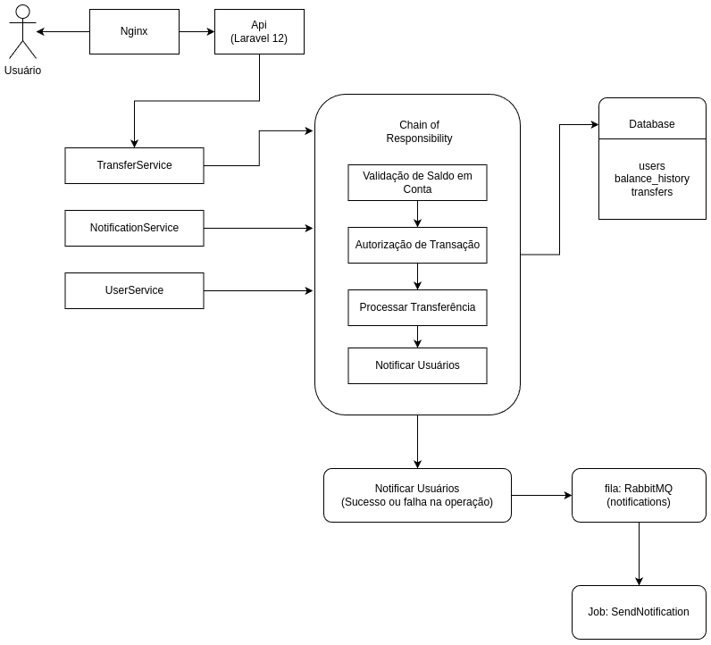
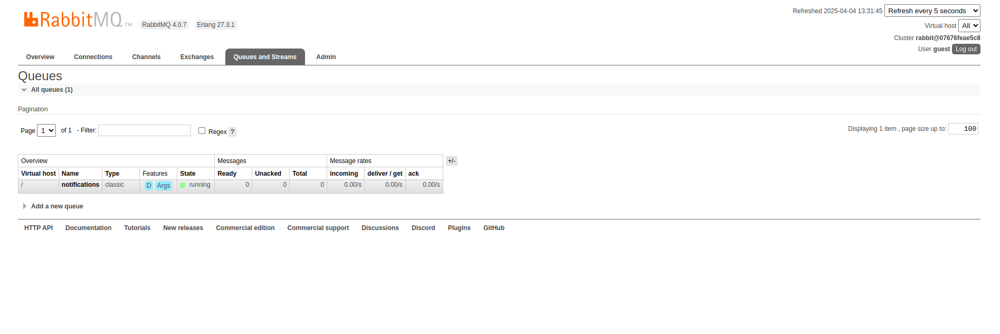
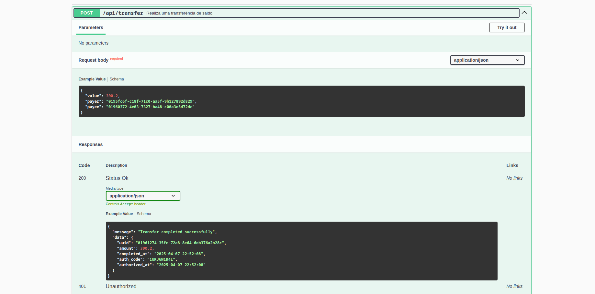

# Simple-bank

API desenvolvida com o objetivo de simular um sistema bancário simplificado, com funcionalidades de transferência entre usuários.

### Tecnologias Utilizadas no projeto: 

* PHP 8.3
* Laravel 12
* Postgres
* RabbitMQ 
* Docker + Docker compose
* Swagger 

### Rodando o projeto 

Clone o repositório do projeto

~~~bash 
    git clone https://github.com/Philipelima/bank-api.git
~~~

Suba os containers:

~~~bash 
   docker compose up -d
~~~

Acesse o container da aplicação

~~~bash 
   docker exec -it simple-bank_app bash
~~~

Dentro do container, instale as dependências

~~~bash
    composer install
~~~

Gere a key da aplicação

~~~bash
    php artisan key:generate
~~~

Gere a documentação Swagger

~~~bash
    php artisan l5-swagger:generate
~~~

Configure o arquivo .env: 

~~~bash 

 DB_CONNECTION=pgsql
 DB_HOST={db_host}
 DB_PORT={db_port}
 DB_DATABASE={db_name}
 DB_USERNAME={db_username}
 DB_PASSWORD={db_password}

 ...

 QUEUE_CONNECTION=rabbitmq

 ... 

 RABBITMQ_HOST={rabbitmq_host}
 RABBITMQ_PORT={rabbitmq_port}
 RABBITMQ_USER={rabbitmq_user}
 RABBITMQ_PASSWORD={rabbitmq_password}
 RABBITMQ_QUEUE={rabbitmq_queue}
~~~

Se tudo estive okay, a api está disponivel no seguinte endereço:  

~~~bash
    http://localhost:8000
~~~

E a documentação em: 

~~~bash
   http://127.0.0.1:8000/api/documentation
~~~

### Regras de Negócio
* Usuários do tipo lojista não podem enviar transferências.

* Transferências exigem saldo suficiente e validação externa de autorização.

* Lojistas só recebem transferências, não enviam dinheiro para ninguém.

### Definição do Banco de Dados: 

O sistema utiliza um modelo relacional composto por três principais entidades:

<b>users</b>

Armazena os dados dos usuários da banco, podendo ser usuários comuns (<code>common</code>) ou lojistas(<code>merchant</code>), através do campo user_type.
 
<b>transfers</b>

Registra todas as transferências realizadas entre usuários.

<b>balance_history</b>

Responsável por registrar todo o histórico de movimentações de saldo dos usuários.
 
 

### A decisão de usar <code>uuid</code> como chave primaria em todas as tabelas 

Uso de UUIDs em vez de IDs autoincrementais  foi adotado para garantir unicidade global e segurança, dessa forma podemos evitar que a previsibilidade dos IDs, evitando ataques com enumeração de recursos da api.

Considerando a possibilidade do sistema evoluit para uma arquitetura distribuida, o uso de uuid  evita problemas de conflitos em sistemas de microserviços ou multiplos bancos.

### A decisão de definir um <code>authorization_code</code> na tabela transfers 

O campo authorization_code foi adicionado para registrar um identificador único da autorização da transação. Esse código serve como uma evidência da autorização emitida por um serviço externo, permitindo rastreabilidade e auditoria de cada transferência realizada.

### A decisão de definir um campo <code>failed_reason</code>

O campo failed_reason foi adicionado à tabela de transações com o objetivo de armazenar a razão pela qual uma transferência não foi concluída com sucesso. Isso pode ser útil para fins de auditoria, monitoramento, e para oferecer transparência ao usuário sobre falhas ocorridas.

## Fluxo de transferência

 

> Toda Transação  inicia-se com o status de pending já no incio do processamento, podendo finalizar em <code>completed</code> ou <code>failed</code> (em caso de falha). 

 

### A decisão de usar o design pattern "chain of responsibility" para o processo de transferência:

O padrão Chain of Responsibility foi utilizado para organizar o processo de transferência em etapas desacopladas e sequenciais. Isso facilita a manutenção, torna o código mais legível e permite adicionar novas regras de negócio com pouca intervenção no código existente. Além disso, permite aplicar o princípio do fail fast, abortando o fluxo assim que uma validação falha.

### A decisão de usar o RabbitMQ no processo de envio de notificações do sistema:

O RabbitMQ foi escolhido por oferecer maior confiabilidade no tratamento de mensagens, com suporte à persistência, o que garante que nenhuma notificação seja perdida mesmo diante de falhas temporárias no consumidor. Além disso, o RabbitMQ proporciona mais controle sobre reentregas e confirmações de leitura, permitindo uma arquitetura mais resiliente, escalável e alinhada com boas práticas de sistemas distribuídos.

### O design pattern do envio de notificações: 

Para o envio de notificações, foi adotado o padrão de projeto Strategy. Essa decisão visa garantir flexibilidade, organização e facilidade de manutenção, permitindo que diferentes canais de notificação (como e-mail, SMS ou push) sejam implementados de forma isolada, respeitando o princípio da abertura para extensão e fechamento para modificação (OCP).

Dessa forma, o sistema pode crescer de forma sustentável, facilitando a adição de novos canais sem impactar os já existentes, promovendo também uma melhor testabilidade e separação de responsabilidades entre os componentes.

## Documentação da API

Para a documentação da API, foi utilizado o Swagger, permitindo que qualquer alteração no código seja rapidamente refletida na documentação, promovendo um alinhamento contínuo entre a implementação e sua descrição.

Para acessar a documentação após rodar o projeto, basta acessar: 

~~~bash
    http://127.0.0.1:8000/api/documentation
~~~

