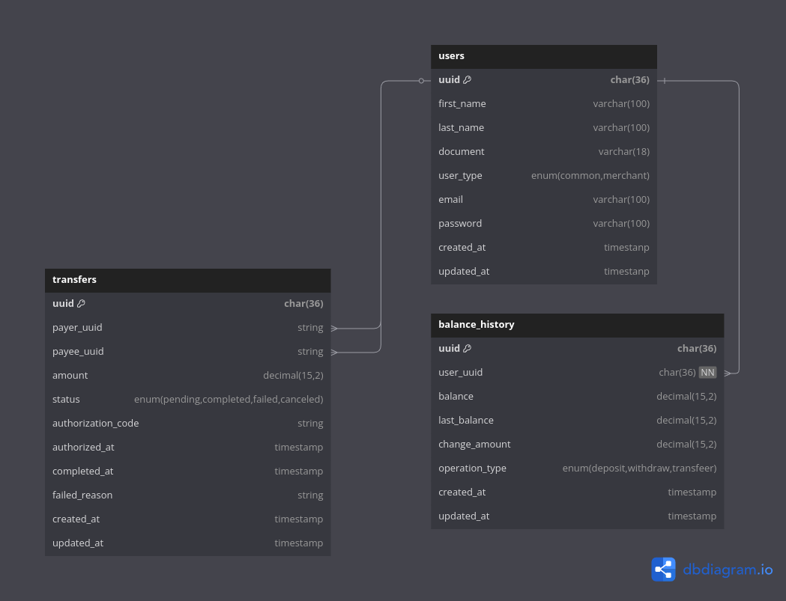

# Simple-bank

API desenvolvida com o objetivo de simular um sistema bancário simplificado, com funcionalidades de transferência entre usuários.

### Tecnologias Utilizadas no projeto: 

* PHP 8.3
* Laravel 12
* Postgres
* RabbitMQ 
* Docker + Docker compose
* Swagger 

### Regras de Negócio
* Usuários do tipo lojista não podem enviar transferências.

* Transferências exigem saldo suficiente e validação externa de autorização.

* Todas as transferências começam com o status pending.

### Definição do Banco de Dados: 

O sistema utiliza um modelo relacional composto por três principais entidades:

<b>users</b>

Armazena os dados dos usuários da banco, podendo ser usuários comuns (<code>common</code>) ou lojistas(<code>common</code>), através do campo user_type.
 
<b>transfers</b>

Registra todas as transferências realizadas entre usuários.

<b>balance_history</b>

Responsável por registrar todo o histórico de movimentações de saldo dos usuários.
 
 

### A decisão de usar <code>uuid</code> como chave primaria em todas as tabelas 

Uso de UUIDs em vez de IDs autoincrementais  foi adotado para garantir unicidade global e segurança, dessa forma podemos evitar que a previsibilidade dos IDs, evitando ataques com enumeração de recursos da api.

Considerando a possibilidade do sistema evoluit para uma arquitetura distribuida, o uso de uuid  evita problemas de conflitos em sistemas de microserviços ou multiplos bancos.

### A decisão de definir um <code>authorization_code</code> na tabela transfers 

O campo authorization_code foi adicionado para registrar um identificador único da autorização da transação. Esse código serve como uma evidência da autorização emitida por um serviço externo, permitindo rastreabilidade e auditoria de cada transferência realizada.